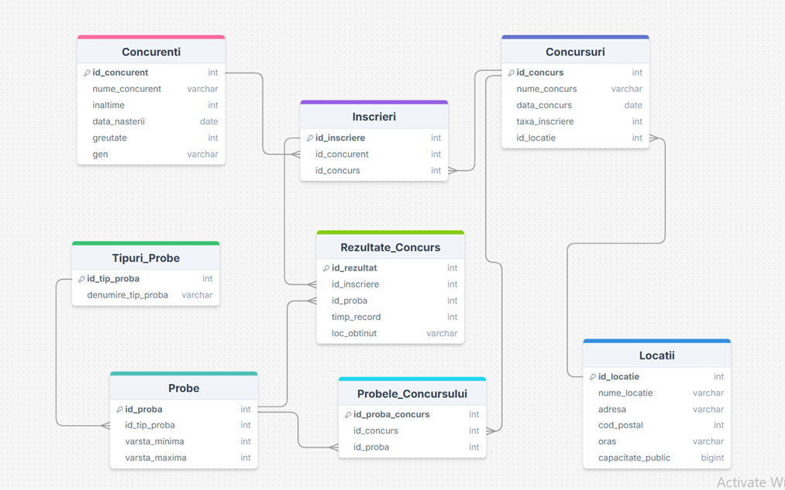

# Sistem Gestiune Competitii Atletism

Sistem de baze de date relationale dezvoltat in **Oracle SQL** pentru administrarea competitiilor sportive, concurentilor si rezultatelor oficiale.

### Schema Bazei de Date (Diagrama E-R)

*(Asigura-te ca numele pozei urcate pe GitHub este identic cu cel de mai sus)*

---

### Functionalitati Cheie
- **Arhitectura:** 8 tabele normalizate cu constrangeri de integritate (PK, FK, Check).
- **Logica Business:** - Calcul automat varsta si categorisire (Copii, Juniori, Adulti, Seniori).
  - Gestionare medalii (Aur, Argint, Bronz) via `DECODE`.
  - Validare date si constrangeri de domeniu.
- **Obiecte SQL:** View-uri, Indeusi de performanta, Secvente si Sinonime.

### Structura Fisiere
- `01_Structura.sql` - Creare tabele si constrangeri.
- `02_Date.sql` - Populare cu date de test.
- `03_Rapoarte.sql` - Interogari complexe si analiza date.
